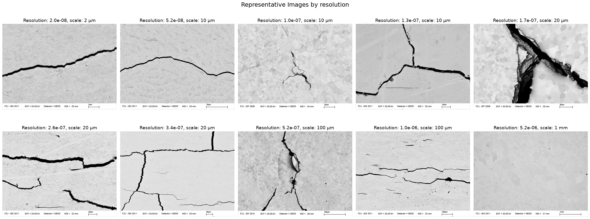
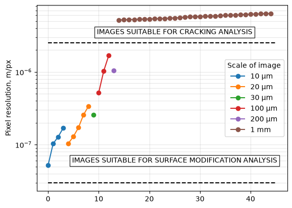
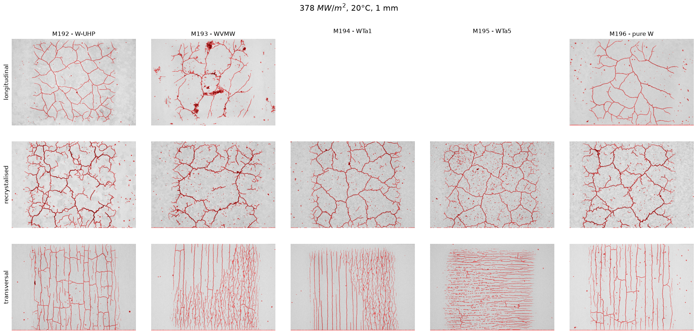

# Setup

### 1. Install Git LFS

This project uses Git LFS for large files (e.g. `data/dataset.h5`).

Install it first:

```bash
git lfs install
```

### 2. Clone the repository

```bash
git clone <repo-url>
cd <repo>
```

### 3. Download LFS files

```bash
git lfs pull
```

### 4. Set up environment (uv)

```bash
uv sync
```
> **Platform note:** `pyproject.toml` uses `[tool.uv].environments` to restrict dependency resolution to a specific operating system. Update configuration marker accordingly (for example, `sys_platform == 'linux'` or `sys_platform == 'win32'`) before running `uv sync`.
>
> **PyTorch note:** This project uses the matched `torch==2.9.1` and `torchvision==0.24.1` releases from the PyTorch CUDA 12.8 wheel index. Select a matched Torch/Torchvision pair and wheel index for your GPU and CUDA version, and update `pyproject.toml` before running `uv sync`.

## Run

### VSCode

Select

```bash
uv run python
```

# Data

Data repository layout details and expected folder structure are documented in [data/README.md](data/README.md).


## Data extraction

The repository stores the raw microscopy data archive as `JUDITH.tar.xz`.
From the project root, extract it into the `data/` directory with:

```bash
tar -xJf data/JUDITH.tar.xz -C data
```

<!-- If you are already inside `data/`, use:

```bash
tar -xJf JUDITH.tar.xz
``` -->

To verify extraction, list top-level folders in `data/`:

```bash
find data -maxdepth 3 -type d | head
```

<!--
## Data processing

The loader uses `build_label2tempflux()` to create a mapping:

```text
experiment label -> (base temperature, thermal flux)
```

The label is extracted from the image filename by taking everything before the first underscore. For example:

```text
184A_001.tif -> label = 184A
```

If a label is not found in the test matrix, the corresponding `base_temp` and `flux` metadata values are set to `NaN`. -->


## Using dataset

The PyTorch compatible dataset is defined in [/src/data_utils.py](../src/data_utils.py) as `JUDITHDataset`.

```python
dataset = JUDITHDataset(preload=True)
```
can be used to read all images in memory.
Use `preload=False` to load data from disk only when requested, e.g., by Dataloader.


<!-- ```python
dataset = create_dataset_from_path(Path("data"))
```

The returned object contains:

```python
Dataset(images, metadata, data_pos, scale_pos, detector_pos)
``` -->

<!-- `images` is a stacked NumPy array containing all `.tif` images:

```text
images.shape = (N, H, W)        # grayscale images
``` -->

<!-- If the source TIFF files contain channels, the channel dimension is preserved. Pixel values are read with `imread()` and cast to integer type. The loader does not normalize, crop, resize, or otherwise preprocess images. -->

### Metadata fields

The `dataset.metadata` dictionary contains one NumPy array per field.
All arrays have length `N`, matching the number of images.

| Field       | Source            | Description                                                                        |
| ----------- | ----------------- | ---------------------------------------------------------------------------------- |
| `filename`  | Image path        | Full path to the `.tif` file.                                                      |
| `material`  | Directory name    | Material string                                                                    |
| `loadtype`  | Directory name    | The cut/loadtype of material                                                       |
| `label`     | Filename          | Experiment label extracted from `<label>_<id>.tif`.                                |
| `base_temp` | Excel test matrix | Base temperature associated with `label`; `NaN` if unavailable.                    |
| `flux`      | Excel test matrix | Thermal flux or power-density value associated with `label`; `NaN` if unavailable. |

Example:

```python
from data_utils import JUDITHDataset

dataset = JUDITHDataset(preload=True)

# original (full) images and extracted data parts
images = dataset.images[0]
data   = dataset.data[0]

filename  = dataset.metadata["filename"][0]
material  = dataset.metadata["material"][0]
loadtype  = dataset.metadata["loadtype"][0]
label     = dataset.metadata["label"][0]
base_temp = dataset.metadata["base_temp"][0]
flux      = dataset.metadata["flux"][0]
```
or
```python
from data_utils import JUDITHDataset

dataset = JUDITHDataset()

# Create DataLoader
dataloader = DataLoader(
    dataset,
    batch_size=32,
    shuffle=True,
    num_workers=4
)

# Iterate
for batch_idx, (images, metadata) in enumerate(dataloader):
    print(f"Batch {batch_idx}: images shape {images.shape}")
    print(f"Materials: {metadata['material']}")
    print(f"Base temps: {metadata['base_temp']}")
    # Train/evaluate here
```

<!-- ### Implementation notes

`top_path` should be passed as a `pathlib.Path` object:

```python
from pathlib import Path

dataset = create_dataset_from_path(Path("data"))
```

The current loader scans files using a case-sensitive `.tif` check. Files with uppercase extensions such as `.TIF` may need to be renamed or the loader adapted.

The order of samples follows the filesystem traversal order. For fully reproducible ordering, sort directory and file paths inside the loader before reading images.

The variables `data_pos`, `scale_pos`, and `detector_pos` are returned as part of the `Dataset` object and should be defined elsewhere in the codebase before calling this function. -->


# Crack identification

Crack identification makes sense only for scans at 1 mm scale






Crack identification is implemented in [/src/crack_identification.py](../src/crack_identification.py)


Example:
```python
from crack_identification import find_cracks

cracks = find_cracks(dataset.data[0])
```




Running  [/src/crack_identification.py](../src/crack_identification.py) as a script finds cracks for all relevant images and puts them into `/src/cracks` folder.


<!-- # crack-identification


## Getting started

To make it easy for you to get started with GitLab, here's a list of recommended next steps.

Already a pro? Just edit this README.md and make it your own. Want to make it easy? [Use the template at the bottom](#editing-this-readme)!

## Add your files

* [Create](https://docs.gitlab.com/user/project/repository/web_editor/#create-a-file) or [upload](https://docs.gitlab.com/user/project/repository/web_editor/#upload-a-file) files
* [Add files using the command line](https://docs.gitlab.com/topics/git/add_files/#add-files-to-a-git-repository) or push an existing Git repository with the following command:

```
cd existing_repo
git remote add origin https://code.ornl.gov/fusion-ml/crack-identification.git
git branch -M main
git push -uf origin main
```

## Integrate with your tools

* [Set up project integrations](https://code.ornl.gov/fusion-ml/crack-identification/-/settings/integrations)

## Collaborate with your team

* [Invite team members and collaborators](https://docs.gitlab.com/user/project/members/)
* [Create a new merge request](https://docs.gitlab.com/user/project/merge_requests/creating_merge_requests/)
* [Automatically close issues from merge requests](https://docs.gitlab.com/user/project/issues/managing_issues/#closing-issues-automatically)
* [Enable merge request approvals](https://docs.gitlab.com/user/project/merge_requests/approvals/)
* [Set auto-merge](https://docs.gitlab.com/user/project/merge_requests/auto_merge/)

## Test and Deploy

Use the built-in continuous integration in GitLab.

* [Get started with GitLab CI/CD](https://docs.gitlab.com/ci/quick_start/)
* [Analyze your code for known vulnerabilities with Static Application Security Testing (SAST)](https://docs.gitlab.com/user/application_security/sast/)
* [Deploy to Kubernetes, Amazon EC2, or Amazon ECS using Auto Deploy](https://docs.gitlab.com/topics/autodevops/requirements/)
* [Use pull-based deployments for improved Kubernetes management](https://docs.gitlab.com/user/clusters/agent/)
* [Set up protected environments](https://docs.gitlab.com/ci/environments/protected_environments/)

***

# Editing this README

When you're ready to make this README your own, just edit this file and use the handy template below (or feel free to structure it however you want - this is just a starting point!). Thanks to [makeareadme.com](https://www.makeareadme.com/) for this template.

## Suggestions for a good README

Every project is different, so consider which of these sections apply to yours. The sections used in the template are suggestions for most open source projects. Also keep in mind that while a README can be too long and detailed, too long is better than too short. If you think your README is too long, consider utilizing another form of documentation rather than cutting out information.

## Name
Choose a self-explaining name for your project.

## Description
Let people know what your project can do specifically. Provide context and add a link to any reference visitors might be unfamiliar with. A list of Features or a Background subsection can also be added here. If there are alternatives to your project, this is a good place to list differentiating factors.

## Badges
On some READMEs, you may see small images that convey metadata, such as whether or not all the tests are passing for the project. You can use Shields to add some to your README. Many services also have instructions for adding a badge.

## Visuals
Depending on what you are making, it can be a good idea to include screenshots or even a video (you'll frequently see GIFs rather than actual videos). Tools like ttygif can help, but check out Asciinema for a more sophisticated method.

## Installation
Within a particular ecosystem, there may be a common way of installing things, such as using Yarn, NuGet, or Homebrew. However, consider the possibility that whoever is reading your README is a novice and would like more guidance. Listing specific steps helps remove ambiguity and gets people to using your project as quickly as possible. If it only runs in a specific context like a particular programming language version or operating system or has dependencies that have to be installed manually, also add a Requirements subsection.

## Usage
Use examples liberally, and show the expected output if you can. It's helpful to have inline the smallest example of usage that you can demonstrate, while providing links to more sophisticated examples if they are too long to reasonably include in the README.

## Support
Tell people where they can go to for help. It can be any combination of an issue tracker, a chat room, an email address, etc.

## Roadmap
If you have ideas for releases in the future, it is a good idea to list them in the README.

## Contributing
State if you are open to contributions and what your requirements are for accepting them.

For people who want to make changes to your project, it's helpful to have some documentation on how to get started. Perhaps there is a script that they should run or some environment variables that they need to set. Make these steps explicit. These instructions could also be useful to your future self.

You can also document commands to lint the code or run tests. These steps help to ensure high code quality and reduce the likelihood that the changes inadvertently break something. Having instructions for running tests is especially helpful if it requires external setup, such as starting a Selenium server for testing in a browser.

## Authors and acknowledgment
Show your appreciation to those who have contributed to the project.

## License
For open source projects, say how it is licensed.

## Project status
If you have run out of energy or time for your project, put a note at the top of the README saying that development has slowed down or stopped completely. Someone may choose to fork your project or volunteer to step in as a maintainer or owner, allowing your project to keep going. You can also make an explicit request for maintainers. -->
